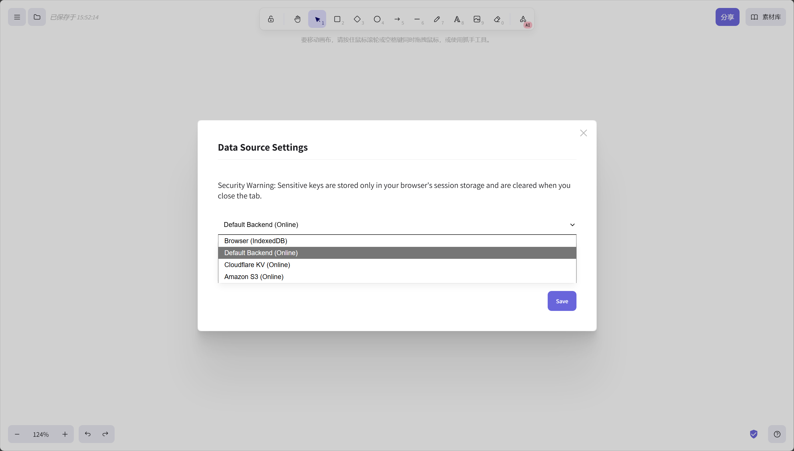
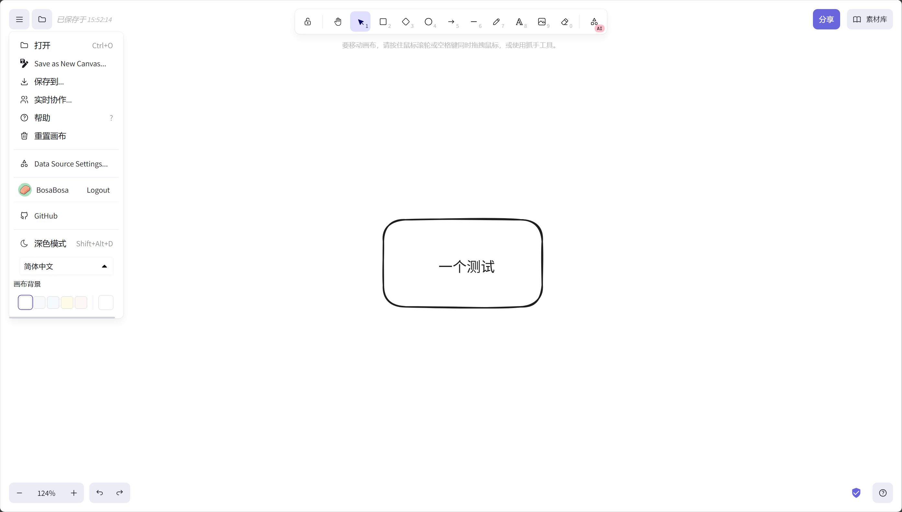
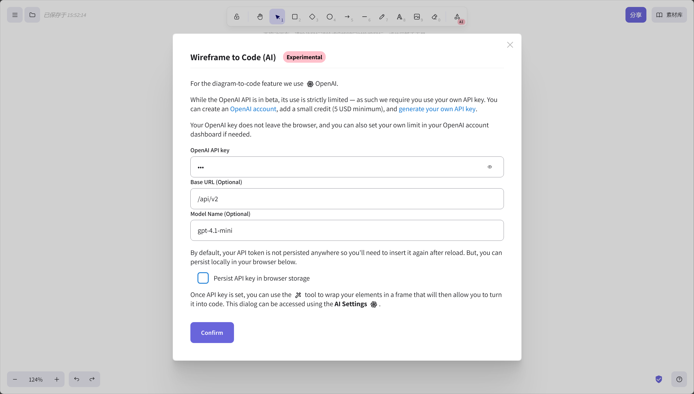

# Excalidraw Full: Your Self-Hosted, Cloud-Ready Collaboration Platform

[中文说明](./README_zh.md)

Excalidraw Full has evolved. It's no longer just a simple wrapper for Excalidraw, but a powerful, self-hosted collaboration platform with a "Bring Your Own Cloud" (BYOC) philosophy. It provides user authentication, multi-canvas management, and the unique ability to connect directly to your own cloud storage from the frontend.

The core idea is to let the backend handle user identity while giving you, the user, full control over where your data is stored.

## Core Differences from Official Excalidraw

- **Fully Self-Hosted Collaboration & Sharing**: Unlike the official version, all real-time collaboration and sharing features are handled by your own self-hosted backend, ensuring complete data privacy and control.
- **Advanced Multi-Canvas Management**: Seamlessly create, save, and manage multiple canvases. Store your work on the server's backend (e.g., SQLite, S3) or connect the frontend directly to your personal cloud storage (e.g., Cloudflare KV) for true data sovereignty.
- **Zero-Config AI Features**: Instantly access integrated OpenAI features like GPT-4 Vision after logging in—no complex client-side setup required. API keys are securely managed by the backend.








## Key Features

- **GitHub Authentication**: Secure sign-in using GitHub OAuth.
- **Multi-Canvas Management**: Users can create, save, and manage multiple drawing canvases.
- **Flexible Data Storage (BYOC)**:
    - **Default Backend Storage**: Out-of-the-box support for saving canvases on the server's storage (SQLite, Filesystem, S3).
    - **Direct Cloud Connection**: The frontend can connect directly to your own cloud services like **Cloudflare KV** or **Amazon S3** for ultimate data sovereignty. Your credentials never touch our server.
- **Real-time Collaboration**: The classic Excalidraw real-time collaboration is fully supported.
- **Secure OpenAI Proxy**: An optional backend proxy for using OpenAI's GPT-4 Vision features, keeping your API key safe.
- **All-in-One Binary**: The entire application, including the patched frontend and backend server, is compiled into a single Go binary for easy deployment.

## Frontend Canvas Storage Strategies

- **IndexedDB**: A fast, secure, and scalable key-value store. No need to configure anything. Not login required.
- **Backend Storage**: The backend can save the canvas to the server's storage (SQLite, Filesystem, S3). Synchronized in different devices.
- **Cloudflare KV**: A fast, secure, and scalable key-value store. This requires deploying a companion Worker to your Cloudflare account. See the [**Cloudflare Worker Deployment Guide**](./cloudflare-worker/README.md) for detailed instructions.
- **Amazon S3**: A reliable, scalable, and inexpensive object storage service. 

## Installation & Running

One Click Docker run [Excalidraw-Full](https://github.com/BetterAndBetterII/excalidraw-full).

```bash
# Example for Linux
git clone https://github.com/BetterAndBetterII/excalidraw-full.git
cd excalidraw-full
mv .env.example .env
touch ./excalidraw.db  # IMPORTANT: Initialize the SQLite DB, OTHERWISE IT WILL NOT START
docker compose up -d
```

The server will start, and you can access the application at `http://localhost:3002`.

## Configuration

Configuration is managed via environment variables. For a full template, see the `.env.example` section below.

### 1. Backend Configuration (Required)

You must configure GitHub OAuth and a JWT secret for the application to function.

- `GITHUB_CLIENT_ID`: Your GitHub OAuth App's Client ID.
- `GITHUB_CLIENT_SECRET`: Your GitHub OAuth App's Client Secret.
- `GITHUB_REDIRECT_URL`: The callback URL. For local testing, this is `http://localhost:3002/auth/github/callback`.
- `JWT_SECRET`: A strong, random string for signing session tokens. Generate one with `openssl rand -base64 32`.
- `OPENAI_API_KEY`: Your secret key from OpenAI.
- `OPENAI_BASE_URL`: (Optional) For using compatible APIs like Azure OpenAI.

### 2. Default Storage (Optional, but Recommended)

This configures the server's built-in storage, used by default.

- `STORAGE_TYPE`: `memory` (default), `sqlite`, `filesystem`, or `s3`.    
- `DATA_SOURCE_NAME`: Path for the SQLite DB (e.g., `excalidraw.db`).
- `LOCAL_STORAGE_PATH`: Directory for filesystem storage.
- `S3_BUCKET_NAME`, `AWS_REGION`, etc.: For S3 storage.

### 3. OpenAI Proxy (Optional)

To enable AI features, set your OpenAI API key.

- `OPENAI_API_KEY`: Your secret key from OpenAI.
- `OPENAI_BASE_URL`: (Optional) For using compatible APIs like Azure OpenAI.

### 4. Frontend Configuration

Frontend storage adapters (like Cloudflare KV, S3) are configured directly in the application's UI settings after you log in. This is by design: your private cloud credentials are only ever stored in your browser's session and are never sent to the backend server.

### Example `.env.example`

Create a `.env` file in the project root and add the following, filling in your own values.

```env
# Backend Server Configuration
# Get from https://github.com/settings/developers
GITHUB_CLIENT_ID=your_github_client_id
GITHUB_CLIENT_SECRET=your_github_client_secret
GITHUB_REDIRECT_URL=http://localhost:3002/auth/github/callback

# Generate with: openssl rand -base64 32
JWT_SECRET=your_super_secret_jwt_string

# Default Storage (SQLite)
STORAGE_TYPE=sqlite
DATA_SOURCE_NAME=excalidraw.db

# Optional OpenAI Proxy
OPENAI_API_KEY=sk-your_openai_api_key
```

## Building from Source

The process is similar to before, but now requires the Go backend to be built.

### Using Docker (Recommended)

```bash
# Clone the repository with submodules
git clone https://github.com/PatWie/excalidraw-complete.git --recursive
cd excalidraw-complete

# Build the Docker image
# This handles the frontend build, patching, and Go backend compilation.
docker build -t excalidraw-complete -f excalidraw-complete.Dockerfile .

# Run the container, providing the environment variables
docker run -p 3002:3002 \
  -e GITHUB_CLIENT_ID="your_id" \
  -e GITHUB_CLIENT_SECRET="your_secret" \
  -e GITHUB_REDIRECT_URL="http://localhost:3002/auth/github/callback" \
  -e JWT_SECRET="your_jwt_secret" \
  -e STORAGE_TYPE="sqlite" \
  -e DATA_SOURCE_NAME="excalidraw.db" \
  -e OPENAI_API_KEY="your_openai_api_key" \
  excalidraw-complete
```

### Manual Build

1.  **Build Frontend**: Follow the steps in the original README to patch and build the Excalidraw frontend inside the `excalidraw/` submodule.
2.  **Copy Frontend**: Ensure the built frontend from `excalidraw/excalidraw-app/build` is copied to the `frontend/` directory in the root.
3.  **Build Go Backend**:
    ```bash
    go build -o excalidraw-complete main.go
    ```
4.  **Run**:
    ```bash
    # Set environment variables first
    ./excalidraw-complete
    ```
---

Excalidraw is a fantastic tool. This project aims to make a powerful, data-secure version of it accessible to everyone. Contributions are welcome!
