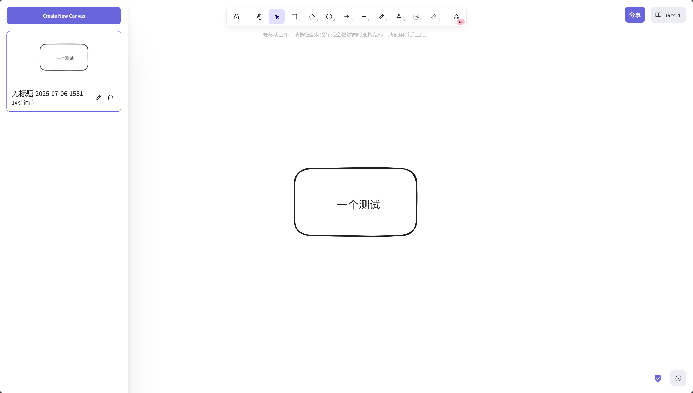

# Excalidraw Full: 您的自托管、云就绪协作平台

Excalidraw Full 已经进化。它不再仅仅是 Excalidraw 的一个简单封装，而是一个强大的、自托管的协作平台，秉承"自带云"（BYOC - Bring Your Own Cloud）的理念。它提供用户认证、多画板管理，以及从前端直接连接到您自己的云存储的独特能力。

其核心思想是让后端处理用户身份，同时让您（用户）完全控制数据的存储位置。

## 与官方 Excalidraw 的核心区别

- **完全自托管的协作与分享**: 与官方版 Excalidraw 不同，所有的实时协作和分享功能都由您自己部署的后端服务处理，确保了数据的私密性和可控性。
- **强大的多画布管理**: 您可以轻松创建、保存和管理多个画布。数据可以存储在服务器后端（如 SQLite、S3），也可以由前端直接连接到您自己的云存储（如 Cloudflare KV），实现了真正的"数据主权"。
- **开箱即用的 AI 功能**: 无需复杂的客户端配置，登录后即可直接使用集成的 OpenAI 功能（如 GPT-4 Vision），API 密钥由后端安全管理，前端只负责调用。





## 主要特性

- **GitHub 认证**：使用 GitHub OAuth 安全登录。
- **多画板管理**：用户可以创建、保存和管理多个绘图画板。
- **灵活的数据存储 (BYOC)**：
    - **默认后端存储**：开箱即用地支持将画板保存在服务器的存储中（SQLite、文件系统、S3）。
    - **直接云连接**：前端可以直接连接到您自己的云服务，如 **Cloudflare KV** 或 **Amazon S3**，以实现终极数据主权。您的凭证永远不会触及我们的服务器。
- **实时协作**：完全支持经典的 Excalidraw 实时协作功能。
- **安全的 OpenAI 代理**：一个可选的后端代理，用于使用 OpenAI 的 GPT-4 Vision 功能，确保您的 API 密钥安全。
- **一体化二进制文件**：整个应用程序，包括打过补丁的前端和后端服务器，都被编译成一个单一的 Go 二进制文件，便于部署。

## 前端画板存储策略

- **IndexedDB**: 一种快速、安全且可扩展的键值存储。无需任何配置，也无需登录。
- **后端存储**: 后端可以将画板保存到服务器的存储中（SQLite、文件系统、S3）。可在不同设备间同步。
- **Cloudflare KV**: 一种快速、安全且可扩展的键值存储。这需要您在自己的 Cloudflare 账户中部署一个配套的 Worker。请参阅 [**Cloudflare Worker 部署指南**](./cloudflare-worker/README.md) 获取详细说明。
- **Amazon S3**: 一种可靠、可扩展且经济的对象存储服务。

## 安装与运行

一键 Docker 运行 [Excalidraw-Full](https://github.com/BetterAndBetterII/excalidraw-full).

```bash
# Linux 示例
git clone https://github.com/BetterAndBetterII/excalidraw-full.git
cd excalidraw-full
mv .env.example .env
touch ./excalidraw.db  # 重要：初始化 SQLite 数据库，否则无法启动
docker compose up -d
```

服务器将启动，您可以在 `http://localhost:3002` 访问该应用。

<!-- Summary Folded -->
<details>
<summary>使用简单密码认证(Dex OIDC)</summary>

```bash
# 示例
git clone https://github.com/BetterAndBetterII/excalidraw-full.git
cd excalidraw-full
mv .env.example .env
touch ./excalidraw.db  # 重要：初始化 SQLite 数据库，否则无法启动
docker compose -f docker-compose.dex.yml up -d
```

修改 `.env` 文件中的密码。

```bash
# apt install apache2-utils
# 生成密码哈希
echo YOUR_NEW_PASSWORD | htpasswd -BinC 10 admin | cut -d: -f2 > .htpasswd
# 更新 .env 文件
sed -i "s|ADMIN_PASSWORD_HASH=.*|ADMIN_PASSWORD_HASH='$(cat .htpasswd)'|" .env
```

</details>


## 配置

配置通过环境变量进行管理。有关完整模板，请参阅下面的 `.env.example` 部分。

### 1. 后端配置 (必需)

您必须配置 GitHub OAuth 和 JWT 密钥才能使应用程序正常运行。

- `GITHUB_CLIENT_ID`: 您的 GitHub OAuth App 的 Client ID。
- `GITHUB_CLIENT_SECRET`: 您的 GitHub OAuth App 的 Client Secret。
- `GITHUB_REDIRECT_URL`: 回调 URL。对于本地测试，这是 `http://localhost:3002/auth/callback`。
- `JWT_SECRET`: 用于签署会话令牌的强随机字符串。使用 `openssl rand -base64 32` 生成一个。
- `OPENAI_API_KEY`: 您在 OpenAI 的秘密密钥。
- `OPENAI_BASE_URL`: (可选) 用于使用兼容的 API，如 Azure OpenAI。

### 2. 默认存储 (可选，但推荐)

这会配置服务器的内置存储，默认使用。

- `STORAGE_TYPE`: `memory` (默认), `sqlite`, `filesystem`, 或 `s3`。
- `DATA_SOURCE_NAME`: SQLite 数据库的路径 (例如, `excalidraw.db`)。
- `LOCAL_STORAGE_PATH`: 文件系统存储的目录。
- `S3_BUCKET_NAME`, `AWS_REGION`, 等: 用于 S3 存储。

### 3. OpenAI 代理 (可选)

要启用 AI 功能，请设置您的 OpenAI API 密钥。

- `OPENAI_API_KEY`: 您在 OpenAI 的秘密密钥。
- `OPENAI_BASE_URL`: (可选) 用于使用兼容的 API，如 Azure OpenAI。

### 4. 前端配置

前端存储适配器（如 Cloudflare KV, S3）在您登录后直接在应用程序的 UI 设置中配置。这是特意设计的：您的私有云凭证只存储在浏览器的会话中，绝不会发送到后端服务器。

### `.env.example` 示例

在项目根目录中创建一个 `.env` 文件，并添加以下内容，填入您自己的值。

```env
# 后端服务器配置
# 从 https://github.com/settings/developers 获取
GITHUB_CLIENT_ID=your_github_client_id
GITHUB_CLIENT_SECRET=your_github_client_secret
GITHUB_REDIRECT_URL=http://localhost:3002/auth/callback

# 使用以下命令生成: openssl rand -base64 32
JWT_SECRET=your_super_secret_jwt_string

# 默认存储 (SQLite)
STORAGE_TYPE=sqlite
DATA_SOURCE_NAME=excalidraw.db

# 可选的 OpenAI 代理
OPENAI_API_KEY=sk-your_openai_api_key
```

## 从源码构建

过程与之前类似，但现在需要构建 Go 后端。

### 使用 Docker (推荐)

```bash
# 克隆仓库及其子模块
git clone https://github.com/PatWie/excalidraw-complete.git --recursive
cd excalidraw-complete

# 构建 Docker 镜像
# 此过程会处理前端构建、打补丁和 Go 后端编译。
docker build -t excalidraw-complete -f excalidraw-complete.Dockerfile .

# 运行容器，并提供环境变量
docker run -p 3002:3002 \
  -e GITHUB_CLIENT_ID="your_id" \
  -e GITHUB_CLIENT_SECRET="your_secret" \
  -e GITHUB_REDIRECT_URL="http://localhost:3002/auth/callback" \
  -e JWT_SECRET="your_jwt_secret" \
  -e STORAGE_TYPE="sqlite" \
  -e DATA_SOURCE_NAME="excalidraw.db" \
  -e OPENAI_API_KEY="your_openai_api_key" \
  excalidraw-complete
```

### 手动构建

1.  **构建前端**: 按照原始 README 中的步骤，在 `excalidraw/` 子模块内打补丁并构建 Excalidraw 前端。
2.  **复制前端**: 确保将 `excalidraw/excalidraw-app/build` 中构建好的前端文件复制到根目录的 `frontend/` 目录下。
3.  **构建 Go 后端**:
    ```bash
    go build -o excalidraw-complete main.go
    ```
4.  **运行**:
    ```bash
    # 首先设置环境变量
    ./excalidraw-complete
    ```
---

Excalidraw 是一个很棒的工具。该项目旨在让每个人都能使用一个功能强大、数据安全的版本。欢迎贡献！ 